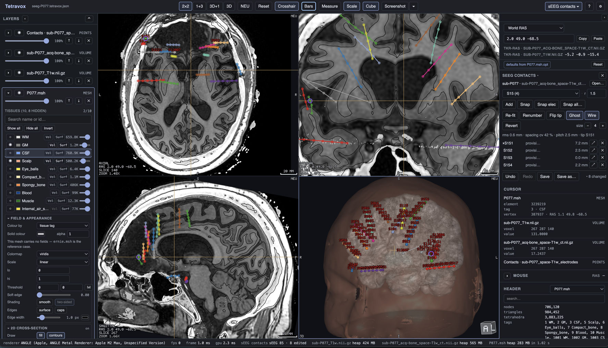

# sEEG contacts — a Tetravox extension



`tetravox.seeg` is a contact editor for stereo-EEG depth electrodes, built as a downloadable
[Tetravox](https://github.com/idossha/tetravox) extension: open a registered CT and the BIDS
`electrodes.tsv` that was localised on it, fix what the localiser got wrong, and write the table back
— reversibly, with a backup and a provenance sidecar.

It ships as **one ESM file plus its manifest**. Tetravox downloads both, verifies each against its own
sha256, asks you what it may do, and only then lets it run.

|           |                                                            |
| --------- | ---------------------------------------------------------- |
| Module id | `tetravox.seeg`                                            |
| Host API  | 1                                                          |
| Requires  | Tetravox with downloadable extensions (File ▸ Extensions…) |
| Licence   | MIT                                                        |

---

## Install

### Through Tetravox

**File ▸ Extensions…**, find _sEEG contacts_, **Install**, then **Enable** and read the permission
sheet. That is the whole of it: the download is verified against the catalogue's hashes, the manifest
is validated before anything is registered, and nothing is executable until you have consented.

### By hand

Every release attaches its two files twice — once under a human name, once under the file's own
sha256, which is the name Tetravox's catalogue fetches. To install by hand, take the human-named
copies:

```sh
ID=tetravox.seeg
VERSION=0.1.0
DIR=~/.tetravox/modules/$ID/$VERSION
mkdir -p "$DIR"
cd "$DIR"
curl -LO https://github.com/idossha/tetravox-seeg/releases/download/v$VERSION/index.js
curl -LO https://github.com/idossha/tetravox-seeg/releases/download/v$VERSION/manifest.json
```

Then write the **install receipt** beside them. Tetravox re-hashes every file against this receipt
each time the module is enabled — a downloaded file is a script, and one that changed after it was
installed is one that never runs:

```sh
cat > tetravox-module.json <<JSON
{
  "schema": 1,
  "id": "$ID",
  "version": "$VERSION",
  "installedAt": "$(date -u +%Y-%m-%dT%H:%M:%SZ)",
  "files": [
    { "name": "index.js",      "bytes": $(wc -c < index.js),      "sha256": "$(shasum -a 256 index.js | cut -d' ' -f1)" },
    { "name": "manifest.json", "bytes": $(wc -c < manifest.json), "sha256": "$(shasum -a 256 manifest.json | cut -d' ' -f1)" }
  ]
}
JSON
```

Restart Tetravox and enable it in **File ▸ Extensions…**. (`TETRAVOX_MODULE_DIR` overrides
`~/.tetravox/modules` if you keep extensions elsewhere.)

---

## Using it

### Opening a subject

Drop, or **Open…**, either of these and the module finds the other beside it:

| File                 | Where                                                                    |
| -------------------- | ------------------------------------------------------------------------ |
| the registered CT    | `derivatives/seegprep/sub-<id>/ct/sub-<id>_acq-bone_space-T1w_ct.nii.gz` |
| the electrodes table | `derivatives/seegprep/sub-<id>/ieeg/sub-<id>_space-T1w_electrodes.tsv`   |

From the CT it also looks for the `_coordsystem.json`, an existing `_editlog.json`, `seegprep`'s
`sub-<id>_electrodes-geometry.json`, and the subject's T1 at
`derivatives/SimNIBS/sub-<id>/m2m_<id>/T1.nii.gz`. Nothing is searched for: the module knows those
five names and asks whether each one exists.

Opening the **table first** is fine — it is read and held until a volume arrives, and the panel says so.
The CT has to be open for anything that needs image intensities (that is Snap), because a module reads
the volume through the app rather than opening files itself.

The reader is deliberately forgiving. It detects tab, comma, semicolon or whitespace; strips a UTF-8
BOM; matches column names case-insensitively (`name`/`label`, `x`/`pos_x`/`x_mm`, or `R`/`A`/`S`);
takes the electrode from `electrode`, `group`, `shaft` or `lead`, or infers it by stripping the trailing
digits off the contact name (`LHIP8` → `LHIP`); and truncates a ragged row rather than refusing the file.
A 3D Slicer `.fcsv` markups file works too, LPS coordinates and all. A missing required column is the one
thing it refuses, and the message names the delimiter it detected and the columns it found.

If an `_editlog.json` already sits beside the table, the panel shows a banner saying when it was
hand-edited: somebody has been here before you.

### Editing

The contacts are one points layer named `Contacts · <table stem>`, one dot per contact, with the shaft
drawn as a line between consecutive contacts and each contact's name beside it. **The dot, its shaft
line and its name are all the electrode's own colour**, so on a fifteen-shaft implant you can tell at a
glance which line belongs to which contact. Contacts that are not on the current slice are drawn as
**ghosts** at 0.6 opacity so a shaft reads as a shaft while you scroll; `g` turns that off and on.

Three switches decide how much of that is drawn, and none of them touches the table:

| Switch          | Does                                                                              |
| --------------- | --------------------------------------------------------------------------------- |
| **Ghost** (`g`) | draw the contacts that are not on this slice, faintly                             |
| **Wire** (`d`)  | draw the shaft lines. Off is for a figure about one slice's contacts              |
| **size − / +**  | how big a contact is drawn, 2–12 px. The bigger dot is also a bigger click target |

All three are saved with the scene, so a figure reopens looking the way you left it, and all three are job-file
operations (`ghost`, `wire`, `size`) — which of them are on is part of what a figure _is_.

| Do this                   | With                                                                                     |
| ------------------------- | ---------------------------------------------------------------------------------------- |
| select a contact          | click it in a pane — ghosts included — or click its row in the list                      |
| move one                  | drag it in a 2D pane, once the slice is on it                                            |
| add contacts              | **Add** (`a`) — then every click in a pane drops a new contact on the chosen electrode   |
| walk the electrode        | `n` / `p`, or the list — the crosshair follows, so every pane slices through the contact |
| snap to the metal         | `s` for the selected contact, `⇧S` for the whole electrode, **Snap all…** for every one  |
| add the missing contacts  | **Extend**, when the model says the shaft has more than the table does                   |
| renumber from the tip     | **Renumber tip-first**                                                                   |
| flip which end is the tip | `t`                                                                                      |
| delete                    | `Delete` or `⌫`                                                                          |
| undo / redo               | `z` / `⇧Z`                                                                               |

**Clicking a contact selects it**, and everything follows: the electrode dropdown switches to that
contact's shaft, the crosshair moves onto it so every pane slices through it, and a ring is drawn round
the one you have. You do not arm anything first — while the panel is open, clicking contacts is what a
click does, and `Esc` puts you back into selecting rather than turning the tool off. A click that is not
on a contact still moves the crosshair, exactly as it does with no module open.

**Clicking a ghosted contact jumps the slice to it.** A ghost is a contact that lives on another slice, so
there is no sensible way to _drag_ one — it would move in a plane it is not in. Clicking one therefore does
the useful half instead: it selects that contact and takes the crosshair there, so every pane re-cuts through
it. The contact you clicked is now on the slice, and a second click grabs it in the ordinary way. In practice
you click the marker you can see, the view comes to it, and you drag from there — you never have to scroll
onto a contact first to be able to pick it.

**Snap** puts a contact **on its electrode's shaft**, at the point along it where the CT is
brightest. A depth electrode is one rigid rod, so its contacts are collinear by construction — and a
snap that could move a contact sideways is a snap with a degree of freedom the hardware does not
have. What it does, whatever the scope and whether or not the model is known:

1. fits the electrode's axis through all of its contacts, rejecting one that is off the line;
2. puts each contact at the **orthogonal projection onto that axis** of its blob's intensity-weighted
   centroid — the sideways part of the centroid is what the hardware forbids, the along-axis part is
   measured metal;
3. re-fits the axis through those centroids and retakes the projections. **That is the only sideways
   adjustment, and it moves the whole electrode.** No contact ever carries a lateral offset of its
   own;
4. reads the CT along the axis in a 1 mm tube, every 0.1 mm, through ±0.45 × the shaft's own pitch, to
   decide **whether a contact has metal at all** — under 35% of the electrode's median peak it has
   none, and takes the model's slot if a model is known or keeps its own projection if not. The
   profile says whether, never where: between 5 mm-pitch contacts it is a bloom-merged ripple rather
   than one peak per contact;
5. and where the model is known, anchors the manufacturer's gap template on the contacts that have
   metal and uses it as a **check**: a detected contact more than 0.35 × the local gap from its slot
   stays on its metal and is flagged in the per-gap table, because that is the shaft a human should
   look at.

The panel prints which mode ran: `snapped along axis · model BF10R-SP21X`, or
`· measured pitch 5.0 mm` when nothing resolved a model. Without a model the measured median pitch
sizes the search **window** and nothing else — an observed median is not a datasheet, and it never
re-spaces a shaft.

The radius field (0.5–5 mm, 1.5 mm by default) is what the fallback path uses: on a host without
`sampleVolume` the snap reads `peakCentroid` at that radius and **projects its answer onto the
axis**, keeping which blob and where along it, discarding the sideways part. A contact with nothing
bright near it does not move. An electrode with fewer than three contacts has no rod to fit and keeps
the old per-contact centroid snap, alone.

Why it is like this: on P073, snapping each contact to its own blob's intensity centroid made the
contacts zigzag 0.3–0.7 mm around the straight trajectory line the drag guide draws — CT bloom is not
symmetric about the rod, so each centroid was pulled a different way. The contacts are on a rod;
now the snap says so.

_Snap all_ asks first, because it touches every electrode at once; one snap of any scope is a single
undo step, and none of them renumbers.

### Which electrode is this?

`seegprep`'s catalogue knows forty-four depth-electrode models, and knowing which one a shaft is
changes what "correct" means for it. An Ad-Tech Behnke-Fried lead is **3.0 mm** between contacts 1
and 2 and **5.5 mm** from there out; a snap that re-spaces at the shaft's own *median* gap turns that
into a uniform 5.5 mm and leaves contact 2 two and a half millimetres off the metal it is inside. So
the panel has a model section, and it looks in three places in this order:

| Where                                                       | What it gives                                          |
| ----------------------------------------------------------- | ------------------------------------------------------ |
| `sub-<id>_electrodes-geometry.json`, where it names a model | this subject's own per-electrode gaps, from seegprep    |
| the bundled gap table, keyed by a model or part number       | the manufacturer's geometry for that model             |
| that sidecar's `model: "n/a"` rows                           | the shaft's **measured** median pitch, labelled as such |
| nothing                                                      | the shaft's own observed median gap                    |

The third row needs saying. seegprep's sidecar always states a `spacing_gaps_mm`: when *its*
catalogue matched nothing it writes `model: "n/a"` and fills the vector with the shaft's own median
pitch repeated, so a QC reader always has a nominal to compare against. That is a useful number and
it is emphatically **not** a datasheet — a Behnke-Fried lead's measured median is 5.5 mm and its
first gap is 3.0 mm. So the module reads `"n/a"` as *no model* (a model called "n/a" is not a thing
to show a clinician, and reading it literally would stop the search), consults the catalogue with the
keys seegprep never saw — the table's `model` column, a site part number — and only then falls back
to the measured vector, shown as **measured pitch · sidecar-measured** rather than as a part number.

The key is the table's own `model` column, or a part number from the site's electrode list, matched
as a **case-insensitive prefix** — `BF10R-SP21X-0C3` finds `BF10R-SP21X`, so nobody has to know which
trailing segments are options. **List…** reads that list (`name,target,part_number,n_contacts,…`)
through a file sheet; it has to be a sheet rather than an automatic discovery, because the list lives
at `sub-<id>/etc/sub-<id>_electrodes.csv`, four directories above the derivative's `ieeg/`, and a
module's sibling rule may ascend at most three.

**No model at all is a supported state, not a degraded one.** With nothing resolved the module does
exactly what it did before this existed, and the section says so rather than pretending.

There is **no separate "snap to model" button**. A model, when one resolves, changes what the
ordinary Snap does — step 4 above — rather than offering a second kind of snap to choose between.
The gaps are the manufacturer's and are never stretched, so the template has exactly one free
parameter and a wrong model cannot be made to fit; the per-gap table is what says so, flagging
anything more than 0.75 mm out.

**Extend** places the contacts a shaft is missing, when the model says there are more than the table
has. They go beyond the *entry* end at the model's spacing and are then snapped, and they save with
`status: added` like any contact placed by hand. It asks first, because it adds rows to a clinical
table.

**Numbering only ever changes when you ask.** Loading, placing, dragging, snapping and deleting all leave
every contact's number and name exactly as they were — a clinical table's numbering is wired to the
recording system through its `csc` column, and nothing should renumber it behind your back. Only
_Renumber tip-first_ relabels, and it says so on the button. New names keep the zero-padding the file
used (`LINS01`, not `LINS1`).

**Which end is the tip** is a heuristic, and the panel shows the answer: _contact 1 is the end of the
shaft nearer the centre of the volume_, and the other end is the entry. That is right for nearly every
depth electrode and wrong for some — a shaft entering near the midline can defeat it — so the tip
contact is marked in the list and `t` flips it. A flip is remembered per electrode and saved with the
scene.

### Saving

**Save** writes the table back over the file it came from; **Save as…** picks a new one. Either way three
things happen, in this order:

1. the previous table is copied to `<name>.<YYYYMMDD-HHMMSS>.bak`;
2. the table is written — tab-separated, LF, **your original columns in their original order**, with
   `electrode`, `contact` and `status` appended if they were not already there. `status` is `kept`,
   `edited` (moved by more than 0.001 mm) or `added`; a row that has not moved keeps whatever status the
   localiser gave it, so `located` and `gapfilled` survive;
3. `<stem>_editlog.json` is written beside it ([what is in it](docs/EDITLOG.md)), recording what changed — counts, and one entry per
   contact added, moved, **renamed** or deleted, with where it was and where it is now. Renumber
   relabels contacts that may not have moved at all, and those entries carry the name the table
   had (`renamed_from`) beside the name it has now: relabelling is the one edit that changes how the
   `csc` column maps onto your recording system, so an editlog silent about it would be lying.

That editlog name matters: `seegprep` looks for `*_electrodes_editlog.json` in the subject's `ieeg/`
directory and **refuses to re-run over a hand-edited subject unless you pass `--force`**. If you save
under a name whose stem does not end in `_electrodes`, or outside an `ieeg/` directory, the module warns
you that the guard will not see it.

**Revert to loaded positions** puts every contact back where the file had it and forgets the additions,
which is the in-session undo of everything; the `.bak` is the on-disk one.

⌘S saves the **scene**, not the table. When contacts are unsaved the module says so, the window title
carries a `•`, and closing the window, starting a new scene, opening another one or closing the CT all
ask first.

**By default, Save writes the corrected table** to
`derivatives/tetravox/sub-<id>/ieeg/sub-<id>_space-<space>_electrodes_corrected.tsv` — a copy under the
dataset's own `derivatives/`, alongside a matching `..._corrected_editlog.json` — rather than back over
`seegprep`'s own output; `seegprep`'s `--force` guard now looks for either name. If the table's anchor
is not inside a BIDS dataset the module can find a `derivatives/` root for, Save falls back to the
table's own source path, same as before.

### QC exports

The panel's **QC export** section writes two figures, each as a PDF *and* a PNG, to
`derivatives/tetravox/sub-<id>/ieeg/figures/` by default:

| File                             | What it shows                                                                                                        |
| -------------------------------- | -------------------------------------------------------------------------------------------------------------------- |
| `sub-<id>_desc-reslice_qc.pdf`   | One page holding the whole small-multiples grid: three panels across, one oblique reslice per electrode              |
| `sub-<id>_desc-reslice_qc.png`   | The same pixels, under seegprep's own filename                                                                        |
| `sub-<id>_desc-implant3d_qc.pdf` | One page: the glass-brain implant overview, four views (superior, left, right, anterior) tiled 2×2 with a legend      |
| `sub-<id>_desc-implant3d_qc.png` | The same pixels, under seegprep's own filename                                                                        |

A `derivatives/tetravox/dataset_description.json` marks the folder as a BIDS derivative, written once
if it is not already there.

**Both figures are built to match `seegprep`'s.** `seegprep`'s `reports/figures.py` —
`electrode_reslice` and `implant_3d` — is the specification, down to the plane basis (`cross(axis, +z)`),
`margin_mm = 12` / `width_mm = 22` / `res_mm = 0.4`, the 2nd–99th percentile T1 window, the 1200–3000 HU
`autumn` overlay at `alpha = 0.85`, the `6.2 × 3.0` inch panels at 150 dpi, the lime tip square, the
`_IMPLANT_PALETTE` colours, the 0.45 mm tubes and 1.3 mm contact spheres, the `zoom = 1.4` camera and the
suptitle wording. Two things differ, both on purpose:

1. **the contact rings are the electrode's own colour** (the colour it has in the app), not seegprep's
   single cyan; and
2. **the 3-D centre-to-centre distance between neighbouring contacts** is printed between their rings, in
   the same colour — the real distance in the head, not the in-plane one the picture would suggest for a
   lead leaning out of its own reslice plane.

`src/qc/mpl.ts` is the matplotlib stand-in that makes this possible inside a bundle that may import
nothing: the `gray` and `autumn` LUTs, points-to-pixels at the style sheet's dpi, axes with `origin="lower"`
and `aspect="equal"`, spines and ticks, the suptitle, and `savefig(bbox="tight")` (measured on the rendered
pixels). What it does *not* reproduce is matplotlib's `tight_layout` solver — panels are placed with padding
derived from the same font sizes, so panel positions can differ from a matplotlib render by a few pixels.

The figure's laid-out geometry is measured off seegprep's own PNG rather than taken from its `figsize`:
`tight_layout` packs a 930 x 450 px cell into a 799 x 358 px pitch and `bbox="tight"` crops the rest, so the
figsize alone produced a canvas 18% too tall. Measured against seegprep's `sub-P076` figures (12 leads, 106
contacts, same CT and SimNIBS T1): the reslice figure is 2419 x 1590 px against seegprep's 2406 x 1541 (0.5%
and 3%), with the same panel order, the same per-panel data extents, the same tick values and 37 728 sampled
warm-overlay pixels against 36 036. The implant figure's brain silhouette has a mean IoU of 0.87 against
seegprep's, per view 0.82 (superior) / 0.89 (left) / 0.91 (right) / 0.84 (anterior), at median grey 193
against 205.

**The 3-D implant figure is rendered, not screenshotted** (0.2.2). Through 0.2.1 it drove the app's own 3-D
view through four camera presets and captured each — which showed the app rather than a glass brain, and
left your camera at the superior preset. It is now drawn from the contacts plus a brain mask sampled out of
the SimNIBS tissue map when one is loaded (seegprep's `brain_labels = (1, 2)`), else an Otsu cut on the T1.
**Your 3-D view is not touched.**

`src/qc/isosurface.ts` is the surface half: marching cubes at 1.4 mm — with the 256-case table *computed*
from the cube's own topology rather than typed, and checked against a sphere's analytic area, volume and
watertightness — then Taubin λ/μ smoothing, as seegprep runs `smooth_taubin`. `qc/implant3d.ts` rasterises
it as back-to-front translucent triangles at `alpha = 0.14` with three-light shading, so gyri, sulci, the
cerebellum and the overlapping hemispheres all read; the leads are drawn after the brain, at full colour.
The mask is found in two passes (a coarse one to locate the brain, a fine one inside that box) because one
pass over the padded box would be six times `sampleVolume`'s cap. `decimate` is not reproduced, so the mesh
is denser than seegprep's — a run-time difference, not a visible one. If no volume is open the leads are
still drawn and a toast says the brain is missing.

**A Save sheet opens the first time you export**, pre-filled with that default path — press Save and
the figures land exactly there. Tetravox lets an extension write only where you have named a file, so
there is no way to skip it; it is asked once per table, and _Export to…_ asks again if you want the
figures somewhere else. Choosing any folder works: the 3-D figure and both PNGs are written beside the
reslice one.

**If a figure cannot be written, the panel says why** — the missing CT, the electrode with too few
contacts, or whatever the app itself refused with. (Through 0.2.0 it said `error`, which was not
enough to act on.)

**Outside a BIDS derivatives tree** there is no `{sub}`-shaped default to offer, so the Save sheet is
pre-filled with a name built from the loaded table's own stem instead — `<stem>_desc-reslice_qc.pdf`
— and `dataset_description.json` is written only when a real derivatives tree was found.

The PDFs are written by `src/qc/pdf.ts`, about 150 lines: each figure is a JPEG passed through as a
`/DCTDecode` image XObject with no embedded font, because the module bundle carries no dependencies at
all. The PNG is the same canvas encoded the other way.

### Scenes, and a build without the module

The contacts are ordinary scene layers, so a `*.tetravox.json` written here opens anywhere — including
in a build that has no sEEG module, which still draws every contact with its name, its electrode and its
number. What that build cannot carry is the module's own record: which table the contacts came from,
where that table put each one, and its other columns. Re-open such a scene here and the module rebuilds
the electrodes from the layer, tells you the provenance is gone, and turns Save into Save as… rather than
writing a table in which everything looks new.

### From a job file

Every button is also a job-file operation, so a batch can do what the panel does — `load`, `snap`,
`extend`, `renumber`, `flip-tip`, `revert`, `delete`, `ghost`, `wire`, `size`, `stats`, `save` and
`export-qc`. `export-qc`'s `out` names the reslice PDF under `--out`; the 3-D figure is written beside
it, and the operation answers with a reason per figure rather than a status word. `snap` reports, per electrode, which mode ran (`axis` or `axis-model`) and the
model it used, so a batch learns what it got. `flip-tip` matters more
than it looks: which end of a shaft is contact 1 comes from a heuristic, `renumber` applies whatever the
tip currently is, and this is how a batch corrects the shaft the heuristic read backwards — the same thing
`t` does in the panel. See [Automation](https://idossha.github.io/tetravox/AUTOMATION.html).

---

## Developing

```sh
pnpm install                     # the SDK comes from vendor/, see below
node scripts/fetch-contacts.mjs  # the shared contacts kit, for the tests
pnpm run typecheck               # tsc against the SDK's declarations
pnpm run test                    # vitest
pnpm run build                   # dist/index.js + dist/manifest.json
pnpm run check                   # zero imports, size, the manifest validator, the catalogue pin
```

`pnpm run verify` is all five in order, and is what CI runs.

### What this module is written against

Everything comes from **`@tetravox/module-sdk`** — the host surface (`ModuleHost`, `ModuleInstance`,
`ExtensionBlock`), the manifest contract, the type-only slice of the engine a module may name, the
shared contacts kit, and React. It is generated from the Tetravox tree by `scripts/emit-module-sdk.mjs`
there, never hand-written and never published to npm: an SDK belongs to one core release, and a URL
says which.

Until Tetravox cuts the release that carries it, this repository pins the tarball it was emitted from
as a **file dependency** in `vendor/`:

```json
"@tetravox/module-sdk": "file:vendor/tetravox-module-sdk-1-0.2.0.tgz"
```

At the next core release that becomes the release-asset URL and `vendor/` goes away:

```json
"@tetravox/module-sdk": "https://github.com/idossha/tetravox/releases/download/v<core>/tetravox-module-sdk-1-<core>.tgz"
```

### The one rule: the bundle has no imports

Tetravox loads a module over `tetravox://module/<id>/<version>/index.js`, where nothing resolves a bare
specifier — no import map, no `node_modules`, and a CSP that grants script execution to that host and
to nothing else. So the SDK is **inlined** rather than external (`rollup.config.mjs` has
`external: []`), and `scripts/check-bundle.mjs` asserts on the built bytes that there is no `import`,
no `export … from`, no dynamic `import()`, that the file is under the app's 32 MiB ceiling for a module
file, and that the shim really is in there.

That inlined shim reads `globalThis.__tetravoxModuleSdk`, which the app assigns before any module
activates. It is how a downloaded panel renders inside the app's **own** React tree: a second copy of
React would be an "invalid hook call" the first time the panel drew.

### The bundled electrode catalogue

`src/catalogue.gen.ts` is **generated**, from `seegprep`'s own
`src/seegprep/data/electrode_models.json`. seegprep owns the numbers — two programs disagreeing about
how far apart an RD10R-SP05X's contacts are would give a clinician two different answers to "is this
shaft right" — and this repository owns the copy that ships inside the bundle:

```sh
node scripts/gen-catalogue.mjs --from ../seegprep/src/seegprep/data/electrode_models.json
node scripts/gen-catalogue.mjs --check   # part of `pnpm run check`
```

`catalogue.pin.json` records the sha256 of the source it came from *and* of the generated file, like
`contacts.pin.json` does for the kit. `--check` verifies the generated file always, and the source
only when a seegprep checkout is actually present — so CI, which has never seen seegprep, still
catches a hand-edited catalogue.

It is baked in rather than read at run time because a module bundle has no `node_modules`, no import
map and no network, and a lab's subject directory is not guaranteed to carry seegprep's package data.
Forty-four models is 3 kB.

### The shared contacts kit

`contacts.*` — the TSV reader, the editlog, the line fit, the snap, the palette — is Tetravox's, not
this repository's. A module's second module is a library, not a fork, so two contact modules share one
implementation and the app hands each of them its own single instance.

The SDK tarball carries the kit's declarations, which is enough to typecheck against and nothing to
execute, so the **tests** fetch the sources: `contacts.pin.json` names one Tetravox commit and every
file's sha256, `scripts/fetch-contacts.mjs` downloads and verifies them into `.contacts/` (git-ignored),
and `test/setup.ts` installs them on the host global exactly as the app does. Point
`TETRAVOX_CONTACTS` at a Tetravox checkout's
`packages/app/src/renderer/src/modules/shared/contacts` to use one instead. With neither, the suites
that execute the kit skip — loudly — rather than asserting against a re-implementation of it.

### Layout

```
src/
  manifest.ts   what the module declares — data only; scripts/emit-manifest.mjs makes the JSON
  index.ts      activate(host) → ModuleInstance
  editor.ts     the state and every command; every command is also a job operation
  Panel.tsx     chrome: reads the model through useSyncExternalStore, one call per control
  block.ts      the module's own record inside a scene file
  shaft.ts      depth-electrode geometry — the tip rule, renumber, per-shaft stats
  modelsnap.ts  which electrode this *is* — model resolution, the axis snap, the template slide, extend
  catalogue.gen.ts  GENERATED: the gap table, from seegprep's electrode_models.json
  qc/pdf.ts     a minimal PDF writer — JPEG XObjects and base-14 Helvetica, no dependency
  bids.ts       the seegprep derivative layout
test/           vitest; test/setup.ts is the app's half of the SDK global
scripts/        build, validate, fetch, release
```

## Releasing

```sh
pnpm run verify
scripts/publish-release.sh v0.1.0 --upload
```

Every asset is uploaded **under its own sha256** — the content-addressed store layout Tetravox already
uses for sample data, and what lets a download be verified against its own URL — with a human-named
copy beside it for people reading the release page. The script then prints the two fragments the other
repositories need: the `modules.lock` entry for Tetravox (which bundles this module into its packaged
builds) and the `versions[]` entry for the extensions registry. Both carry the same hashes, and the app
refuses any file whose bytes do not match.

## Licence

MIT, matching Tetravox. See [LICENSE](LICENSE).
